# Assignment 4 - NCU Regulation KG Q&A System

## 1. Project Overview

This project builds a Knowledge Graph (KG) from NCU regulation documents and uses it to answer regulation-related questions.

The system pipeline includes:

1. Convert regulation documents into structured SQLite data
2. Build a Neo4j Knowledge Graph
3. Retrieve relevant regulation rules from the graph
4. Generate grounded answers using a local Hugging Face LLM
5. Evaluate the system with `auto_test.py`

The final KG schema is:

`(Regulation)-[:HAS_ARTICLE]->(Article)-[:CONTAINS_RULE]->(Rule)`

---

## 2. KG Schema Design

### Node Types

#### Regulation
Represents one regulation document.

Properties:
- `id`
- `name`
- `category`

#### Article
Represents one article under a regulation.

Properties:
- `number`
- `content`
- `reg_name`
- `category`

#### Rule
Represents rule-level facts extracted from an article.

Properties:
- `rule_id`
- `type`
- `action`
- `result`
- `art_ref`
- `reg_name`

---

## 3. Relationship Design

### `(:Regulation)-[:HAS_ARTICLE]->(:Article)`
Used to represent which regulation contains which article.

### `(:Article)-[:CONTAINS_RULE]->(:Rule)`
Used to represent which article contains which extracted rule.

This design makes the graph suitable for both:
- document-level tracing
- rule-level retrieval for Q&A

---

## 4. System Workflow

### Step 1. Data Preparation
The regulation source files are processed and stored in `ncu_regulations.db`.

### Step 2. KG Construction
`build_kg.py` reads the SQLite database and builds the Neo4j graph:
- create `Regulation` nodes
- create `Article` nodes
- create `Rule` nodes
- build `HAS_ARTICLE` and `CONTAINS_RULE` relationships

### Step 3. Rule Extraction
Rule extraction is implemented in a deterministic rule-based way:
- split article text into sentence-like segments
- infer rule type by keywords
- build `action` and `result`
- create fallback rules if no explicit rule is extracted

### Step 4. Retrieval and Answering
`query_system.py`:
- expands keywords from the user question
- retrieves relevant `Article` / `Rule` content from Neo4j
- ranks candidate rules
- generates grounded answers with a local LLM

### Step 5. Evaluation
`auto_test.py` tests the system using the provided benchmark questions.

---

## 5. Implementation Details

### 5.1 build_kg.py
Main responsibilities:
- read SQLite data
- create graph nodes and relationships
- extract rule-level facts
- create full-text indexes
- print coverage summary

### 5.2 query_system.py
Main responsibilities:
- parse user question
- expand keywords
- retrieve relevant rules from the KG
- generate grounded answers

### 5.3 llm_loader.py
Loads a local Hugging Face model:
- `Qwen/Qwen2.5-3B-Instruct`

### 5.4 Key Cypher Query Design and Retrieval Strategy

The retrieval module in `query_system.py` uses Neo4j to search for relevant rules from the Knowledge Graph.

### Retrieval Strategy
The system first expands keywords from the user question, then performs rule retrieval by matching terms against:
- `Article.content`
- `Rule.action`
- `Rule.result`
- `Rule.reg_name`

The main retrieval logic uses Cypher to match:

- `(:Article)-[:CONTAINS_RULE]->(:Rule)`

Candidate rules are scored based on keyword matches.  
Additional heuristic weighting is applied for different question types, such as:
- exam-related questions
- student ID replacement questions
- general academic regulation questions
- time-related questions
- penalty-related questions

This design improves retrieval precision without requiring a larger external model.

### Example Query Pattern
A representative Cypher pattern used in retrieval is:

```cypher
MATCH (a:Article)-[:CONTAINS_RULE]->(r:Rule)
RETURN r.rule_id, r.type, r.action, r.result, r.art_ref, r.reg_name
```

This allows the system to retrieve rule-level evidence instead of only article-level text.

### 5.5 Failure Analysis and Improvements Made

During development, the system went through several iterations.

**Initial Problems**

At the beginning:

* The graph only contained `Regulation` and `Article`
* `Rule` nodes were not constructed yet
* `CONTAINS_RULE` relationships were missing
* Retrieval often returned empty results
* The auto-test accuracy was initially very low

**Improvements Made**

To improve the system, the following changes were made:

1. Implemented deterministic rule extraction in `build_kg.py`
* Split article text into sentence-like segments
* Infer rule type using keyword heuristics
* Generate `action` and `result`
* Add fallback rules when no explicit rule is extracted

2. Built complete rule-level graph structure
* Created `Rule` nodes
* Connected `Article` to Rule using `CONTAINS_RULE`

3. Improved retrieval in `query_system.py`
* Added keyword expansion for English question variants
* Used keyword matching against `Article.content`, `Rule.action`, and `Rule.result`
* Added heuristic ranking for exam/admin/general question types
* Improved handling of time-limit and penalty questions

4. Improved grounded answer generation
* Answers are generated from retrieved evidence only
* The system avoids relying on unsupported external knowledge

**Remaining Limitations**

Although the system performs well overall, some limitations remain:

* Rule extraction is heuristic rather than fully semantic
* Some questions require more precise interpretation of regulation wording
* Retrieval is still sensitive to wording differences
* Local model answers may vary slightly depending on evidence ranking

Nevertheless, the final system achieved usable benchmark performance and successfully demonstrated a complete KG-based regulation Q&A workflow.

This project uses a local model instead of external API services.

---

## 6. Key Results

### Graph Construction Result
- Number of `Article` nodes: **159**
- Number of `Rule` nodes: **199**
- Number of `CONTAINS_RULE` relationships: **199**

### Coverage Result
- Covered articles: **159 / 159**
- Uncovered articles: **0**

### Evaluation Result
- Final auto-test accuracy: 75.0%

---

## 7. Screenshots

### 7.1 KG Structure Overview
Shows the graph structure with `Regulation`, `Article`, and `Rule` nodes.

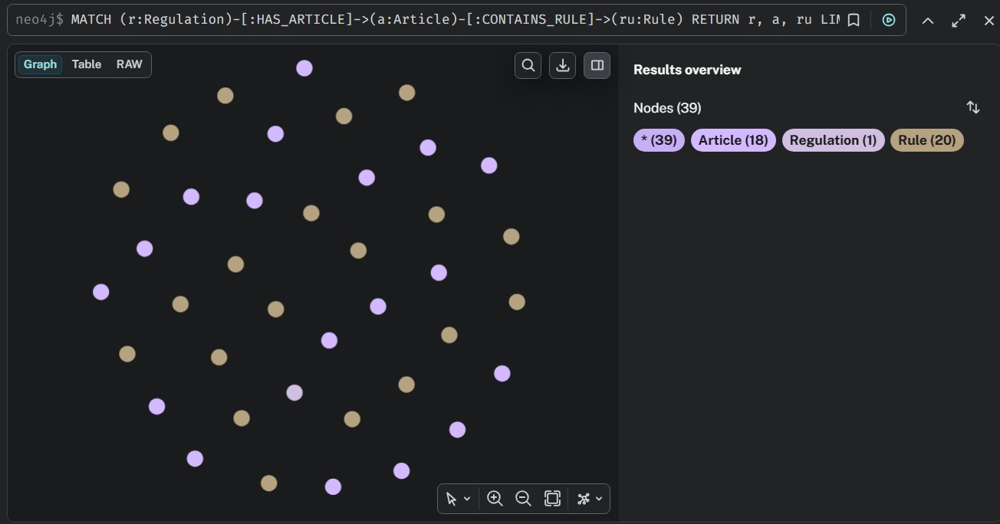

### 7.2 Article Count
Shows the total number of `Article` nodes.

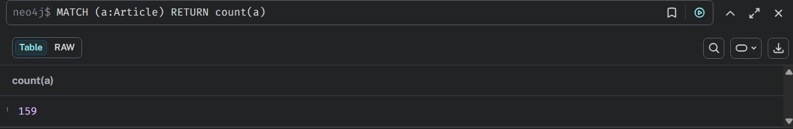

### 7.3 Rule Count
Shows the total number of `Rule` nodes.

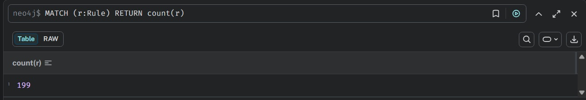

### 7.4 Relationship Count
Shows the total number of `CONTAINS_RULE` relationships.

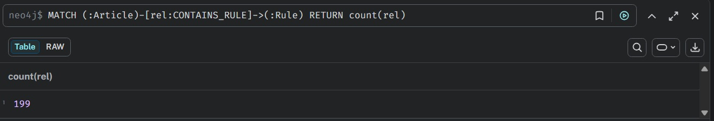

### 7.5 Rule Samples
Shows sample extracted rules.

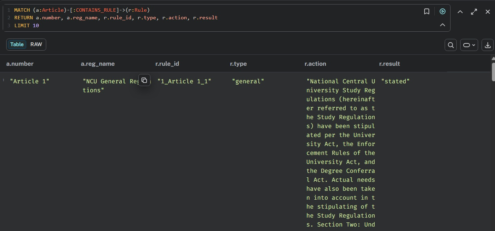
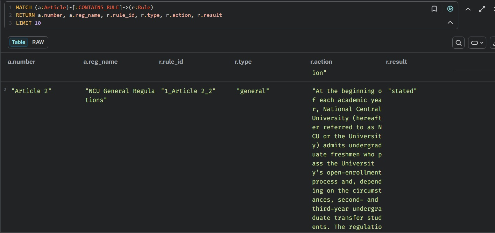
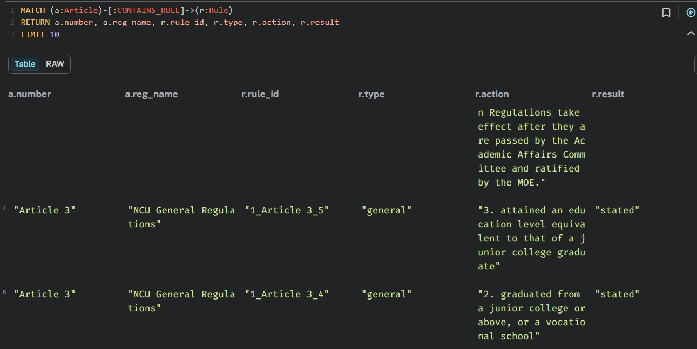

### 7.6 Coverage Output
Shows the terminal output of KG construction coverage.

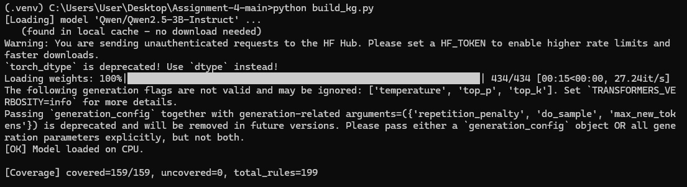

### 7.7 Auto Test Summary
Shows the final benchmark evaluation result.

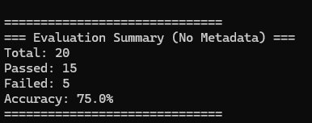

### 7.8 Manual Q&A Demo
Shows one example query answered by the system.

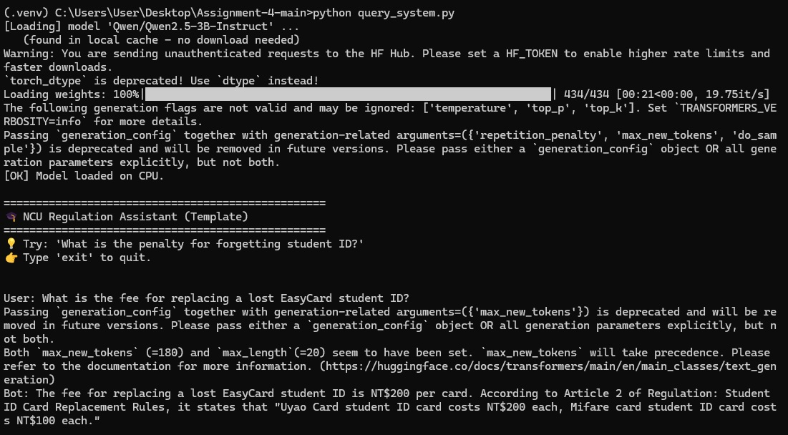

### 7.9 Additional Neo4j Visualization
Additional partial graph views for different relationship layers.

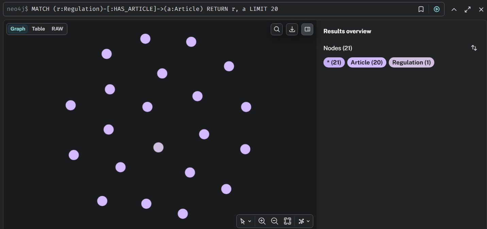
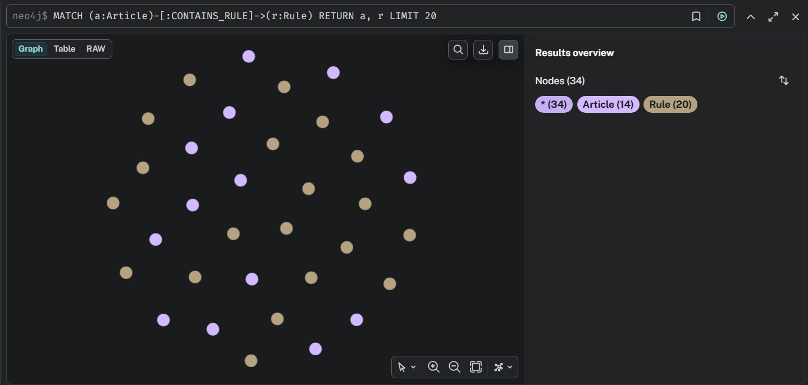

---

## 8. Example Query

### Input
`What is the fee for replacing a lost EasyCard student ID?`

### Output
The system retrieves the relevant rule from `Student ID Card Replacement Rules` and answers with the correct fee.

This demonstrates that the KG can support grounded regulation Q&A.

---

## 9. Challenges and Improvements

### Challenges
1. Regulation text is long and sometimes mixes English and Mandarin.
2. Rule extraction is not always perfectly aligned with human legal interpretation.
3. Retrieval quality depends heavily on keyword matching and ranking.
4. Some questions require more precise semantic understanding than simple keyword overlap.

### Possible Improvements
1. Improve rule extraction quality with better segmentation.
2. Use more precise retrieval/reranking strategies.
3. Add question-type-specific retrieval logic.
4. Improve answer generation stability for edge cases.

---

## 10. How to Run

### 10.1 Start Neo4j
```bash
docker start neo4j
```

* start Neo4j locally
* open Neo4j Browser at `http://localhost:7474`


If the Neo4j container does not exist yet:
```
docker run -d --name neo4j -p 7474:7474 -p 7687:7687 -e NEO4J_AUTH=neo4j/password neo4j:latest
```

After Neo4j is running, open Neo4j Browser in your browser:
```
http://localhost:7474
```

Login with:

* Username: neo4j
* Password: password

### 10.2 Activate virtual environment

```
.venv\Scripts\activate
```

### 10.3 Build the KG

```
python build_kg.py
```

### 10.4 Run interactive Q&A

```
python query_system.py
```

### 10.5 Run evaluation

```
python auto_test.py
```

---

## 11. Required Files

This repository includes:
```txt=
README.md
auto_test.py
build_kg.py
llm_loader.py
query_system.py
requirements.txt
.gitignore
```

---

## 12. Conclusion

This project successfully builds a regulation-oriented Knowledge Graph for NCU regulations and supports grounded question answering using Neo4j and a local Hugging Face model.

The final system can:

* represent regulation structure as a graph
* retrieve relevant rule evidence
* generate grounded answers
* achieve usable benchmark performance on the provided test set
