# NCU Regulation Knowledge Graph Q&A System

A **Knowledge Graph–grounded question answering system** for National Central University (NCU) regulations.

The project converts structured regulation data into a Neo4j Knowledge Graph, retrieves rule-level evidence with Cypher and heuristic ranking, and uses a local Hugging Face LLM to generate grounded answers.

> **Project type:** Academic project / AI application  
> **Core topics:** Knowledge Graph, Neo4j, Cypher, Retrieval, Grounded QA, Local LLM

---

## Project Highlights

- Built a regulation-oriented Knowledge Graph with **Regulation → Article → Rule** structure.
- Converted **159 articles** into graph data and generated **199 rule nodes**.
- Achieved **159 / 159 article coverage** in the final graph.
- Implemented **rule-level retrieval** instead of relying only on whole-article text.
- Added keyword expansion and question-type-aware heuristic ranking to improve retrieval.
- Used a **local `Qwen/Qwen2.5-3B-Instruct` model**, without external LLM API services.
- Achieved **75.0% final auto-test accuracy** on the provided benchmark.

---

## My Contribution

This project was developed based on an assignment framework provided by the course staff.

My work focused mainly on understanding, analyzing, and improving the QA retrieval
and grounded answer generation pipeline, especially in `query_system.py`.

My main work included:

- Tracing and understanding the end-to-end QA retrieval flow.
- Analyzing question preprocessing, including:
  - question normalization
  - tokenization
  - keyword expansion
  - question-type detection
- Understanding and analyzing the interaction between Python and Cypher retrieval.
- Studying the heuristic scoring strategy, including:
  - keyword matching
  - category preference
  - question-type bonus
- Understanding result ranking and deduplication before selecting the Top Rules.
- Analyzing how retrieved Rules are converted into structured evidence.
- Understanding how the local LLM generates answers constrained by retrieved evidence.
- Running the benchmark evaluation and analyzing retrieval limitations and failure cases.

I also studied how the provided data preparation and KG construction components
(`setup_data.py` and `build_kg.py`) connect SQLite regulation data to the Neo4j
Regulation–Article–Rule graph, so that I could understand the complete system pipeline.

---

## System Architecture

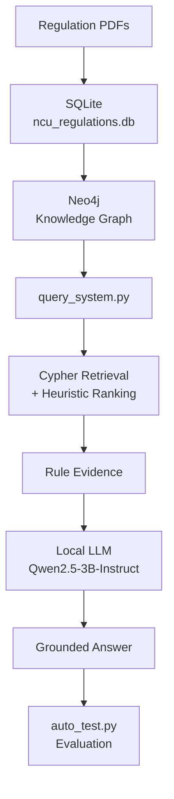
```mermaid
flowchart TD
    PDF["Regulation PDFs"]
    SQLite["SQLite<br/>ncu_regulations.db"]
    KG["Neo4j<br/>Knowledge Graph"]
    QA["query_system.py"]
    Retrieval["Cypher Retrieval<br/>+ Heuristic Ranking"]
    Evidence["Rule Evidence"]
    LLM["Local LLM<br/>Qwen2.5-3B-Instruct"]
    Answer["Grounded Answer"]
    Eval["auto_test.py<br/>Evaluation"]

    PDF --> SQLite
    SQLite --> KG
    KG --> QA
    QA --> Retrieval
    Retrieval --> Evidence
    Evidence --> LLM
    LLM --> Answer
    Answer --> Eval
```

> The overall assignment framework was provided by the course staff.
> My main focus was on understanding and analyzing the QA retrieval and
> grounded answer generation path, particularly `query_system.py`.

The final KG schema is:

```text
(Regulation)-[:HAS_ARTICLE]->(Article)-[:CONTAINS_RULE]->(Rule)
```

---

## Tech Stack

- **Python**
- **Neo4j**
- **Cypher**
- **SQLite**
- **Docker**
- **Hugging Face Transformers**
- **Qwen/Qwen2.5-3B-Instruct**

---

## Key Results

| Metric | Result |
|---|---:|
| Article nodes | **159** |
| Rule nodes | **199** |
| `CONTAINS_RULE` relationships | **199** |
| Article coverage | **159 / 159** |
| Uncovered articles | **0** |
| Final auto-test accuracy | **75.0%** |

The final system demonstrates an end-to-end workflow from structured regulation data to Knowledge Graph retrieval and grounded answer generation.

---

## Knowledge Graph Design
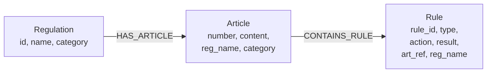
```mermaid
graph LR
    R["Regulation<br/>id, name, category"]
    A["Article<br/>number, content,<br/>reg_name, category"]
    U["Rule<br/>rule_id, type,<br/>action, result,<br/>art_ref, reg_name"]

    R -->|HAS_ARTICLE| A
    A -->|CONTAINS_RULE| U
```
### Node Types

#### `Regulation`

Represents one regulation document.

Properties:

- `id`
- `name`
- `category`

#### `Article`

Represents one article under a regulation.

Properties:

- `number`
- `content`
- `reg_name`
- `category`

#### `Rule`

Represents rule-level facts extracted from an article.

Properties:

- `rule_id`
- `type`
- `action`
- `result`
- `art_ref`
- `reg_name`

### Relationships

#### `(:Regulation)-[:HAS_ARTICLE]->(:Article)`

Represents which regulation contains a given article.

#### `(:Article)-[:CONTAINS_RULE]->(:Rule)`

Connects each article to extracted rule-level facts.

This structure supports both:

- document-level traceability
- rule-level retrieval for question answering

---

## Retrieval & Grounded QA Pipeline

The QA pipeline first preprocesses the user question in Python, then sends
the resulting search terms and question-type signals to Neo4j for heuristic
retrieval and ranking. The highest-ranked Rules are deduplicated and converted
into evidence for grounded answer generation.

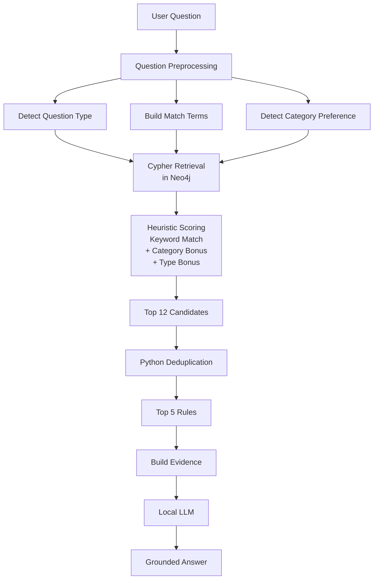
```mermaid
flowchart TD
    Q["User Question"]
    P["Question Preprocessing"]

    QT["Detect Question Type"]
    KW["Build Match Terms"]
    CAT["Detect Category Preference"]

    CYPHER["Cypher Retrieval<br/>in Neo4j"]
    SCORE["Heuristic Scoring<br/>Keyword Match<br/>+ Category Bonus<br/>+ Type Bonus"]

    TOP12["Top 12 Candidates"]
    DEDUP["Python Deduplication"]
    TOP5["Top 5 Rules"]

    EVIDENCE["Build Evidence"]
    LLM["Local LLM"]
    ANSWER["Grounded Answer"]

    Q --> P

    P --> QT
    P --> KW
    P --> CAT

    QT --> CYPHER
    KW --> CYPHER
    CAT --> CYPHER

    CYPHER --> SCORE
    SCORE --> TOP12
    TOP12 --> DEDUP
    DEDUP --> TOP5
    TOP5 --> EVIDENCE
    EVIDENCE --> LLM
    LLM --> ANSWER
```

## System Workflow

### 1. Data Preparation

The regulation source data is processed and stored in:

```text
ncu_regulations.db
```

The repository already includes this SQLite database, so the KG can be rebuilt directly without repeating the original document preprocessing step.

### 2. Knowledge Graph Construction

`build_kg.py` reads the SQLite database and builds the Neo4j graph.

Main tasks include:

- creating `Regulation` nodes
- creating `Article` nodes
- extracting and creating `Rule` nodes
- creating `HAS_ARTICLE` relationships
- creating `CONTAINS_RULE` relationships
- creating full-text indexes
- reporting graph coverage

### 3. Deterministic Rule Extraction

Rule extraction is implemented with a deterministic rule-based approach.

The pipeline:

1. splits article text into sentence-like segments
2. infers rule type using keywords
3. generates `action` and `result`
4. creates fallback rules when no explicit rule is extracted

This ensures that every article can contribute retrievable rule-level evidence even when the source text does not follow a perfectly uniform structure.

### 4. Retrieval and Ranking

`query_system.py` processes a user question by:

1. parsing the question
2. expanding important keywords
3. retrieving relevant `Article` and `Rule` data from Neo4j
4. scoring candidate rules
5. applying additional heuristic weighting
6. selecting evidence for answer generation

Retrieval matches terms against:

- `Article.content`
- `Rule.action`
- `Rule.result`
- `Rule.reg_name`

Additional weighting is applied for question types such as:

- exam-related questions
- student ID replacement questions
- general academic regulation questions
- time-related questions
- penalty-related questions

This improves retrieval precision without requiring a larger external model.

### 5. Grounded Answer Generation

The retrieved evidence is passed to a local Hugging Face model:

```text
Qwen/Qwen2.5-3B-Instruct
```

The answer generation step is designed to use retrieved regulation evidence rather than unsupported external knowledge.

### 6. Evaluation

`auto_test.py` evaluates the full QA pipeline using the provided benchmark questions.

The final evaluation accuracy is:

```text
75.0%
```

---

## Cypher Retrieval Example

A representative retrieval pattern is:

```cypher
MATCH (a:Article)-[:CONTAINS_RULE]->(r:Rule)
RETURN
    r.rule_id,
    r.type,
    r.action,
    r.result,
    r.art_ref,
    r.reg_name
```

Using `Rule` nodes allows the system to retrieve more focused evidence than retrieving only complete article text.

---

## Development Process and Failure Analysis

The system went through several iterations.

### Initial Problems

The early version had several limitations:

- the graph contained only `Regulation` and `Article` nodes
- `Rule` nodes had not been constructed
- `CONTAINS_RULE` relationships were missing
- retrieval frequently returned empty results
- initial auto-test accuracy was very low

### Improvements

#### 1. Added deterministic rule extraction

Implemented rule extraction in `build_kg.py`:

- split article text into sentence-like segments
- inferred rule types with keyword heuristics
- generated `action` and `result`
- added fallback rules

#### 2. Completed the rule-level graph

Added:

```text
Article → CONTAINS_RULE → Rule
```

This changed the system from article-only retrieval to rule-level evidence retrieval.

#### 3. Improved retrieval logic

Enhancements in `query_system.py` included:

- English question keyword expansion
- matching against article and rule fields
- heuristic ranking for different question categories
- better handling of time-limit questions
- better handling of penalty-related questions

#### 4. Improved answer grounding

Answer generation was constrained to retrieved evidence so that the system would avoid relying on unsupported external information.

---

## Example Query

### Input

```text
What is the fee for replacing a lost EasyCard student ID?
```

### System Behavior

The system retrieves the relevant rule from the student ID replacement regulations and uses that evidence to answer the question.

This demonstrates the intended pipeline:

```text
Question
→ KG Retrieval
→ Rule-level Evidence
→ Local LLM
→ Grounded Answer
```

---

## Screenshots

### Knowledge Graph Structure


### Article Count


### Rule Count


### Relationship Count

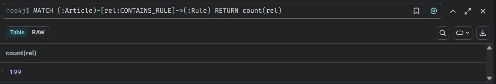

### Extracted Rule Samples

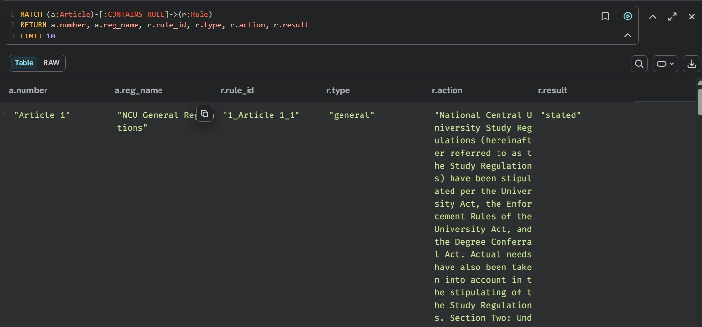

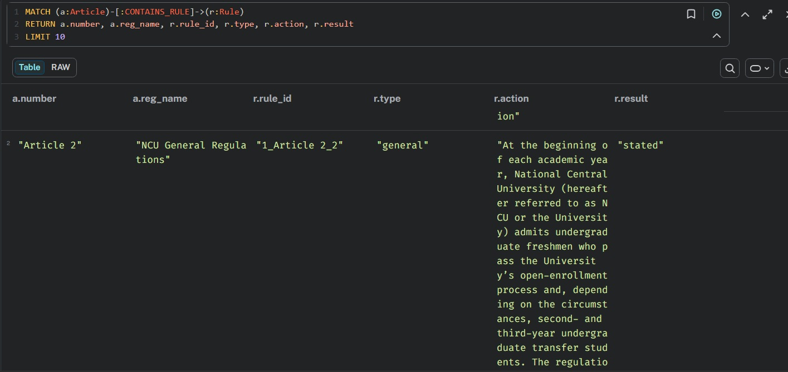

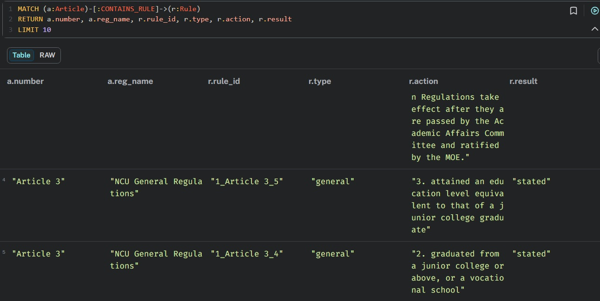

### KG Coverage

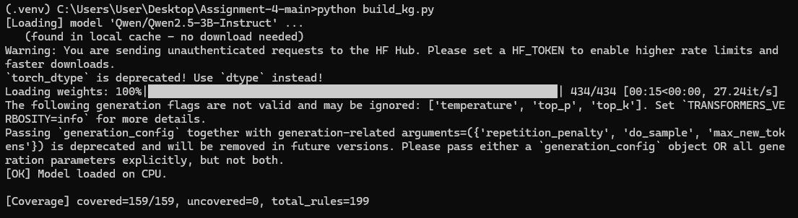

### Benchmark Result

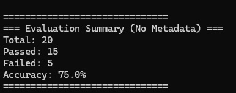

### Manual Q&A Demo

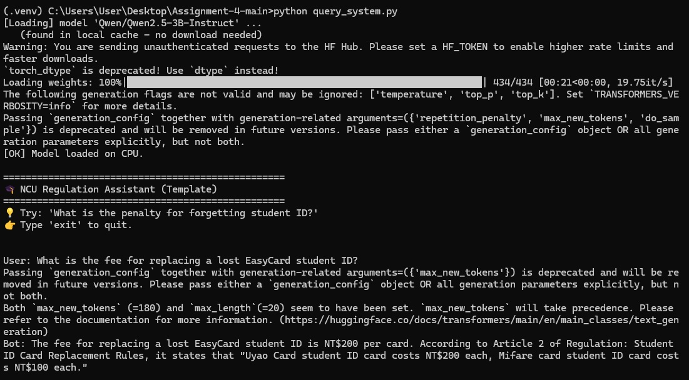

### Additional Neo4j Views

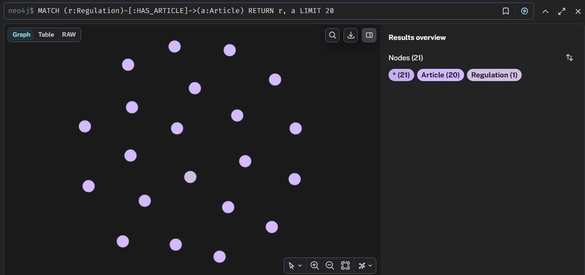

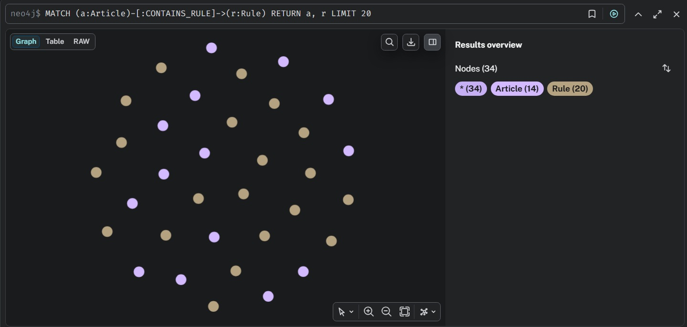

---

## Limitations

The current system still has several limitations:

- rule extraction is heuristic rather than fully semantic
- retrieval remains sensitive to wording differences
- some questions require more precise interpretation of regulation wording
- local model output may vary depending on evidence ranking
- simple keyword overlap is not sufficient for every semantic edge case

These limitations are useful directions for further improvement rather than hidden failure cases.

---

## Possible Improvements

Future improvements could include:

- improving rule segmentation and extraction quality
- adding semantic retrieval or hybrid retrieval
- introducing a dedicated reranking stage
- improving question-type classification
- making answer generation more stable for edge cases
- comparing the KG retrieval approach with a vector-based RAG baseline

---

## How to Run

### 1. Start Neo4j

If the container already exists:

```bash
docker start neo4j
```

If the Neo4j container has not been created yet:

```bash
docker run -d \
  --name neo4j \
  -p 7474:7474 \
  -p 7687:7687 \
  -e NEO4J_AUTH=neo4j/password \
  neo4j:latest
```

Neo4j Browser:

```text
http://localhost:7474
```

Default local login used by this project:

```text
Username: neo4j
Password: password
```

> For a public or production deployment, credentials should be moved to environment variables and replaced with secure values.

### 2. Activate the Virtual Environment

Windows:

```bash
.venv\Scripts\activate
```

### 3. Install Dependencies

```bash
pip install -r requirements.txt
```

### 4. Build the Knowledge Graph

```bash
python build_kg.py
```

### 5. Run Interactive Q&A

```bash
python query_system.py
```

### 6. Run Evaluation

```bash
python auto_test.py
```

---

## Repository Structure

```text
.
├── README.md
├── auto_test.py
├── build_kg.py
├── llm_loader.py
├── query_system.py
├── requirements.txt
├── .gitignore
├── ncu_regulations.db
└── images/
```

---

## Conclusion

This project demonstrates an end-to-end **Knowledge Graph–grounded QA system** for university regulations.

The final system can:

- represent regulation structure as a graph
- extract rule-level facts
- retrieve relevant evidence with Neo4j and Cypher
- generate answers with a local LLM
- evaluate the full pipeline with an automated benchmark

The most important engineering improvement was the transition from article-only retrieval to a complete **Regulation → Article → Rule** graph with rule-level retrieval and heuristic ranking, resulting in full article coverage and a final benchmark accuracy of **75.0%**.
